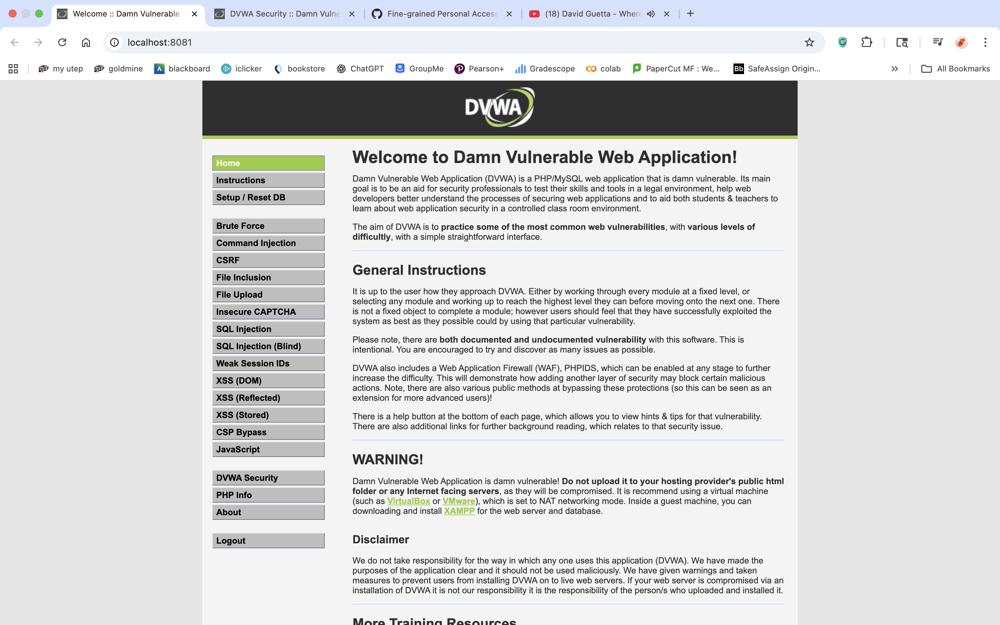
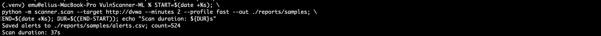
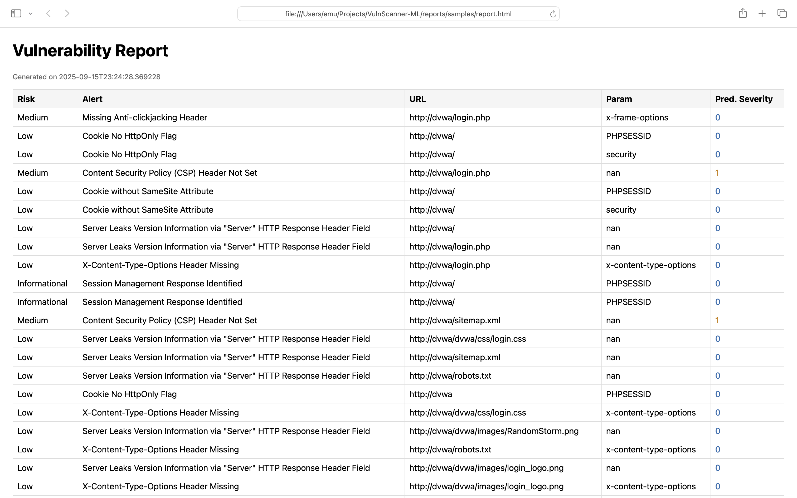

# VulnScanner-ML — Ethical Web Vulnerability Scanner (with basic ML)

**What it does:** Automates OWASP ZAP against a safe target (DVWA), exports findings, classifies severity with a small scikit-learn model, and generates HTML/PDF reports.  
**Use only on DVWA or targets you own/are authorized to test.**

---

## 🔥 Quick Demo

**Scan → ML → Report in under 3 minutes**

| DVWA target | Terminal (scan finished) | HTML report |
| --- | --- | --- |
|  |  |  |

**Metrics (your machine):**
- Detected **XX** vulnerabilities on DVWA  
- Scan time **YY seconds (~YY/60 ≈ ZZ min)**  
- Classifier accuracy **0.XX** (Logistic Regression, simple features)

**Demo video:** [YouTube (Unlisted)](YOUR_YOUTUBE_LINK_HERE)

---

## ⚙️ Tech Stack
- Python 3.x, Docker Compose
- OWASP ZAP (API‐driven)
- scikit-learn (Logistic Regression)
- ReportLab (PDF), Jinja2 (HTML)

---

## 🚀 Run It (TL;DR)

```bash
cp .env.example .env           # set ZAP_API_KEY in .env
docker compose up -d           # start DVWA + ZAP
./tests/zap_smoketest.sh       # verify ZAP API
python -m scanner.scan --target http://dvwa --minutes 2 --profile fast --out ./reports/samples
python -m ml.train --alerts ./reports/samples/alerts.csv --model ./ml/model.pkl
python -m scanner.reporting --alerts ./reports/samples/alerts.csv --model ./ml/model.pkl \
  --html ./reports/samples/report.html --pdf ./reports/samples/report.pdf
